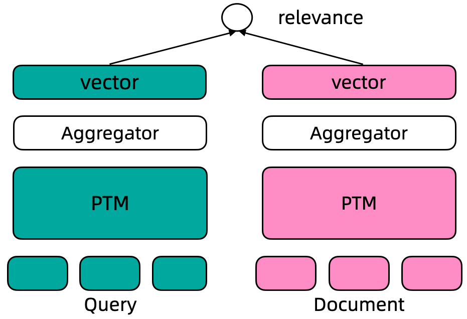

---
tasks:
- sentence-embedding

model-type:
- bert

domain:
- nlp

frameworks:
- pytorch

backbone:
- transformer

metrics:
- mrr@10
- recall@1000
- ndcg@10

license: Apache License 2.0

language:
- en

tags:
- text representation
- text retrieval
- passage retrieval
- Transformer
- GTE
- 文本相关性
- 文本相似度

---

# GTE中文通用文本表示模型

文本表示是自然语言处理(NLP)领域的核心问题, 其在很多NLP、信息检索的下游任务中发挥着非常重要的作用。近几年, 随着深度学习的发展，尤其是预训练语言模型的出现极大的推动了文本表示技术的效果, 基于预训练语言模型的文本表示模型在学术研究数据、工业实际应用中都明显优于传统的基于统计模型或者浅层神经网络的文本表示模型。这里, 我们主要关注基于预训练语言模型的文本表示。

文本表示示例, 输入一个句子, 输入一个固定维度的连续向量:

- 输入: 吃完海鲜可以喝牛奶吗?
- 输出: [0.27162,-0.66159,0.33031,0.24121,0.46122,...]

文本的向量表示通常可以用于文本聚类、文本相似度计算、文本向量召回等下游任务中。

## 文本表示模型

基于监督数据训练的文本表示模型通常采用Dual Encoder框架, 如下图所示。在Dual Encoder框架中, Query和Document文本通过预训练语言模型编码后, 通常采用预训练语言模型[CLS]位置的向量作为最终的文本向量表示。基于标注数据的标签, 通过计算query-document之间的cosine距离度量两者之间的相关性。

<div align=center></div>

GTE-zh模型使用[retromae](https://arxiv.org/abs/2205.12035)初始化训练模型，之后利用两阶段训练方法训练模型：第一阶段利用大规模弱弱监督文本对数据训练模型，第二阶段利用高质量精标文本对数据以及挖掘的难负样本数据训练模型。具体训练方法请参考论文[Towards General Text Embeddings with Multi-stage Contrastive Learning](https://arxiv.org/abs/2308.03281)。

## 使用方式和范围

使用方式:
- 直接推理, 对给定文本计算其对应的文本向量表示，向量维度768

使用范围:
- 本模型可以使用在通用领域的文本向量表示及其下游应用场景, 包括双句文本相似度计算、query&多doc候选的相似度排序

### 如何使用

在ModelScope框架上，提供输入文本(默认最长文本长度为128)，即可以通过简单的Pipeline调用来使用GTE文本向量表示模型。ModelScope封装了统一的接口对外提供单句向量表示、双句文本相似度、多候选相似度计算功能

#### 代码示例
```python
from modelscope.models import Model
from modelscope.pipelines import pipeline
from modelscope.utils.constant import Tasks

model_id = "damo/nlp_gte_sentence-embedding_chinese-base"
pipeline_se = pipeline(Tasks.sentence_embedding,
                       model=model_id,
                       sequence_length=512
                       ) # sequence_length 代表最大文本长度，默认值为128

# 当输入包含“soure_sentence”与“sentences_to_compare”时，会输出source_sentence中首个句子与sentences_to_compare中每个句子的向量表示，以及source_sentence中首个句子与sentences_to_compare中每个句子的相似度。
inputs = {
        "source_sentence": ["吃完海鲜可以喝牛奶吗?"],
        "sentences_to_compare": [
            "不可以，早晨喝牛奶不科学",
            "吃了海鲜后是不能再喝牛奶的，因为牛奶中含得有维生素C，如果海鲜喝牛奶一起服用会对人体造成一定的伤害",
            "吃海鲜是不能同时喝牛奶吃水果，这个至少间隔6小时以上才可以。",
            "吃海鲜是不可以吃柠檬的因为其中的维生素C会和海鲜中的矿物质形成砷"
        ]
    }

result = pipeline_se(input=inputs)
print (result)
'''
{'text_embedding': array([[ 1.6415151e-04,  2.2334497e-02, -2.4202393e-02, ...,
         2.7710509e-02,  2.5980933e-02, -3.1285528e-02],
       [-9.9107623e-03,  1.3627578e-03, -2.1072682e-02, ...,
         2.6786461e-02,  3.5029035e-03, -1.5877936e-02],
       [ 1.9877627e-03,  2.2191243e-02, -2.7656069e-02, ...,
         2.2540951e-02,  2.1780970e-02, -3.0861111e-02],
       [ 3.8688166e-05,  1.3409532e-02, -2.9691193e-02, ...,
         2.9900728e-02,  2.1570563e-02, -2.0719109e-02],
       [ 1.4484422e-03,  8.5943500e-03, -1.6661938e-02, ...,
         2.0832840e-02,  2.3828523e-02, -1.1581291e-02]], dtype=float32), 'scores': [0.8859604597091675, 0.9830712080001831, 0.966042160987854, 0.891857922077179]}
'''


# 当输入仅含有soure_sentence时，会输出source_sentence中每个句子的向量表示。
inputs2 = {
        "source_sentence": [
            "不可以，早晨喝牛奶不科学",
            "吃了海鲜后是不能再喝牛奶的，因为牛奶中含得有维生素C，如果海鲜喝牛奶一起服用会对人体造成一定的伤害",
            "吃海鲜是不能同时喝牛奶吃水果，这个至少间隔6小时以上才可以。",
            "吃海鲜是不可以吃柠檬的因为其中的维生素C会和海鲜中的矿物质形成砷"
        ]
}
result = pipeline_se(input=inputs2)
print (result)
'''
{'text_embedding': array([[-9.9107623e-03,  1.3627578e-03, -2.1072682e-02, ...,
         2.6786461e-02,  3.5029035e-03, -1.5877936e-02],
       [ 1.9877627e-03,  2.2191243e-02, -2.7656069e-02, ...,
         2.2540951e-02,  2.1780970e-02, -3.0861111e-02],
       [ 3.8688166e-05,  1.3409532e-02, -2.9691193e-02, ...,
         2.9900728e-02,  2.1570563e-02, -2.0719109e-02],
       [ 1.4484422e-03,  8.5943500e-03, -1.6661938e-02, ...,
         2.0832840e-02,  2.3828523e-02, -1.1581291e-02]], dtype=float32), 'scores': []}
'''
```

**默认向量维度768, scores中的score计算两个向量之间的内成积距离得到**

### 模型局限性以及可能的偏差

本模型基于Dureader Retrieval中文数据集(通用领域)上训练，在垂类领域英文文本上的文本效果会有降低，请用户自行评测后决定如何使用


### 训练示例代码

```python
# 需在GPU环境运行
# 加载数据集过程可能由于网络原因失败，请尝试重新运行代码
from modelscope.metainfo import Trainers                                                                                                                                                              
from modelscope.msdatasets import MsDataset
from modelscope.trainers import build_trainer
import tempfile
import os

tmp_dir = tempfile.TemporaryDirectory().name
if not os.path.exists(tmp_dir):
    os.makedirs(tmp_dir)

# load dataset
ds = MsDataset.load('dureader-retrieval-ranking', 'zyznull')
train_ds = ds['train'].to_hf_dataset()
dev_ds = ds['dev'].to_hf_dataset()
model_id = 'damo/nlp_gte_sentence-embedding_chinese-base'
def cfg_modify_fn(cfg):
    cfg.task = 'sentence-embedding'
    cfg['preprocessor'] = {'type': 'sentence-embedding','max_length': 256}
    cfg['dataset'] = {
        'train': {
            'type': 'bert',
            'query_sequence': 'query',
            'pos_sequence': 'positive_passages',
            'neg_sequence': 'negative_passages',
            'text_fileds': ['text'],
            'qid_field': 'query_id'
        },
        'val': {
            'type': 'bert',
            'query_sequence': 'query',
            'pos_sequence': 'positive_passages',
            'neg_sequence': 'negative_passages',
            'text_fileds': ['text'],
            'qid_field': 'query_id'
        },
    }
    cfg['train']['neg_samples'] = 4
    cfg['evaluation']['dataloader']['batch_size_per_gpu'] = 30
    cfg.train.max_epochs = 1
    cfg.train.train_batch_size = 4
    return cfg 
kwargs = dict(
    model=model_id,
    train_dataset=train_ds,
    work_dir=tmp_dir,
    eval_dataset=dev_ds,
    cfg_modify_fn=cfg_modify_fn)
trainer = build_trainer(name=Trainers.nlp_sentence_embedding_trainer, default_args=kwargs)
trainer.train()
```

### 模型效果评估

中文多任务向量评测榜单C-MTEB结果如下：

| Model               | Model Size (GB) | Embedding Dimensions | Sequence Length | Average (35 datasets) | Classification  (9 datasets)         | Clustering (4 datasets)        | Pair Classification        (2 datasets) | Reranking (4 datasets)         | Retrieval  (8 datasets)      | STS         (8 datasets) |
| ------------------- | -------------- | -------------------- | ---------------- | --------------------- | ------------------------------------ | ------------------------------ | --------------------------------------- | ------------------------------ | ---------------------------- | ------------------------ |
| gte-base-zh         | 0.21           | 768                  | 512              | 65.17                 | 69.62                                | 50.73                          | 80.12                                   | 66.57                          | 71.11                        | 56.99                    |
| stella-large-zh-v2  | 0.65           | 1024                 | 1024             | 65.13                 | 69.05                                | 49.16                          | 82.68                                   | 66.41                          | 70.14                        | 58.66                    |
| stella-large-zh     | 0.65           | 1024                 | 1024             | 64.54                 | 67.62                                | 48.65                          | 78.72                                   | 65.98                          | 71.02                        | 58.3                     |
| bge-large-zh-v1.5   | 1.3            | 1024                 | 512              | 64.53                 | 69.13                                | 48.99                          | 81.6                                    | 65.84                          | 70.46                        | 56.25                    |
| stella-base-zh-v2   | 0.21           | 768                  | 1024             | 64.36                 | 68.29                                | 49.4                           | 79.96                                   | 66.1                           | 70.08                        | 56.92                    |
| stella-base-zh      | 0.21           | 768                  | 1024             | 64.16                 | 67.77                                | 48.7                           | 76.09                                   | 66.95                          | 71.07                        | 56.54                    |
| piccolo-large-zh    | 0.65           | 1024                 | 512              | 64.11                 | 67.03                                | 47.04                          | 78.38                                   | 65.98                          | 70.93                        | 58.02                    |
| piccolo-base-zh     | 0.2            | 768                  | 512              | 63.66                 | 66.98                                | 47.12                          | 76.61                                   | 66.68                          | 71.2                         | 55.9                     |

## 引用

```BibTeX
@misc{li2023general,
      title={Towards General Text Embeddings with Multi-stage Contrastive Learning}, 
      author={Zehan Li and Xin Zhang and Yanzhao Zhang and Dingkun Long and Pengjun Xie and Meishan Zhang},
      year={2023},
      eprint={2308.03281},
      archivePrefix={arXiv},
      primaryClass={cs.CL}
}
```