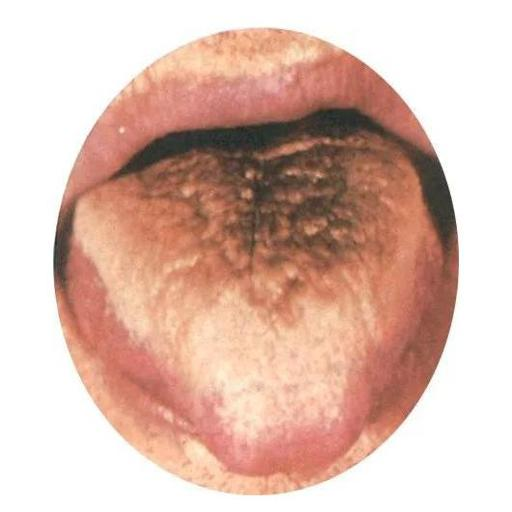

# 诊断报告_2025年04月18日 15时48分47秒

## 患者基本信息
- **性别年龄**：24岁男性  
- **主诉**：  
  - 下腹部钝痛2天（饭后发作，持续1小时后便后缓解）  
  - 排便频率减少（性状正常）  
  - 明显口干  
- **既往史**：无慢性病史及药物过敏  
- **饮食习惯**：偏好辛辣  
- **舌象诊断**：  
  - 黑苔（舌质偏红，厚苔覆盖）  
  - 证候倾向：胃肠湿热、津液耗伤  
  - 建议结合脉诊鉴别实热/阴虚火旺证候  

## 舌象描述
  

### 舌苔特征  
1. **颜色**：舌苔呈现黑色  
2. **厚薄**：舌苔较厚，覆盖大部分舌面  
3. **舌质**：舌体偏红，可能存在裂纹或齿痕  

### 相关健康提示  
1. **热证可能**：湿热或热毒内蕴  
2. **消化系统关联**：消化不良、胃炎等  
3. **其他因素**：  
   - 严重感染（细菌/病毒）  
   - 药物影响（如抗生素、抗真菌药）  

### 注意事项  
- 舌象需结合其他诊断指标综合判断  
- 建议由专业医师进一步评估

## 诊断与辨证结论

### 1. 主诉症状归纳
- **核心症状**：
  - 饭后发作的下腹部钝痛（每次持续1小时，病程2天）
  - 便后缓解
- **伴随症状**：
  - 排便频率减少（大便性状正常）
  - 明显口干（持续存在）
- **加重因素**：辛辣饮食

### 2. 中医辨证要点
- **舌象特征**：
  - 舌质偏红
  - [黑苔厚腻](https://baike.baidu.hk/item/%E6%B9%BF%E7%83%AD%E8%95%B4%E8%92%B8%E8%AF%81/16777164)（提示[湿热蕴结胃肠](https://baike.baidu.hk/item/%E8%83%83%E8%82%A0%E6%B9%BF%E7%83%AD%E8%AF%81/12732030)）
- **脉象说明**：
  - 当前未提供脉诊资料（需补充沉取脉力度及速率以鉴别[实热证](https://baike.baidu.hk/item/%E5%AE%9E%E7%83%AD%E8%AF%81/10746820)/[阴虚火旺](https://baike.baidu.hk/item/%E9%98%B4%E8%99%9A%E7%81%AB%E6%97%BA/9547507)）
- **关键鉴别点**：
  - [实热证](https://baike.baidu.hk/item/%E5%AE%9E%E7%83%AD%E8%AF%81/10746820)：应见脉洪数或滑数，口渴喜冷饮
  - [阴虚火旺](https://baike.baidu.hk/item/%E9%98%B4%E8%99%9A%E7%81%AB%E6%97%BA/9547507)：应见脉细数，五心烦热，夜间盗汗
- **经典参考**：
  - 《伤寒明理续论》"邪气入里与正气相搏则腹痛"
  - 《卷之十》"时痛时止者为热"

### 3. 诊断结论
初步辨证为：
- [胃肠湿热证](https://baike.baidu.hk/item/%E8%83%83%E8%82%A0%E6%B9%BF%E7%83%AD%E8%AF%81/12732030)（可能性较大）
- 需排除[阴虚火旺](https://baike.baidu.hk/item/%E9%98%B4%E8%99%9A%E7%81%AB%E6%97%BA/9547507)证

### 4. 诊断依据
- **饮食因素**：
  - 长期辛辣饮食易生湿热（参考《卷之十》"[积热证](https://baike.baidu.hk/item/%E9%98%B4%E6%B6%B2%E4%B9%8F%E7%AB%AD%E8%AF%81/15622846)"表现）
- **舌象佐证**：
  - [黑苔厚腻](https://baike.baidu.hk/item/%E6%B9%BF%E7%83%AD%E8%95%B4%E8%92%B8%E8%AF%81/16777164)为[湿热熏蒸](https://baike.baidu.hk/item/%E6%B9%BF%E7%83%AD%E8%95%B4%E8%92%B8%E8%AF%81/16777164)之象（《卷之十》"湿痰作痛"相关论述）
- **口干病机**：
  - [湿热伤津](https://baike.baidu.hk/item/%E6%B9%BF%E7%83%AD%E5%A3%85%E6%BB%9E%E8%AF%81/5987651)与[气机阻滞](https://baike.baidu.hk/item/%E6%B0%94%E6%9C%BA%E9%98%BB%E6%BB%9E/1770511)共见（参考《伤寒证辨》少阴病"津液不布"病机）
- **症状特征**：
  - 符合"[热痛得冷稍减](https://baike.baidu.hk/item/%E8%83%83%E8%83%80/3155744)"特点（参考《卷之十》热痛辨证要点）
- **排便异常**：
  - [湿热阻滞](https://baike.baidu.hk/item/%E6%B9%BF%E7%83%AD%E5%A3%85%E6%BB%9E%E8%AF%81/5987651)导致[传导失常](https://baike.baidu.hk/item/%E5%BF%83%E5%AE%A4%E5%86%85%E4%BC%A0%E5%AF%BC%E9%98%BB%E6%BB%9E/467231)（参考《伤寒证辨》[气机不利](https://baike.baidu.hk/item/%E6%B0%94%E6%9C%BA%E9%98%BB%E6%BB%9E/1770511)相关病机）

## 胃肠湿热/阴虚火旺证基础调整方案

### 1. 饮食调整

#### 清热生津推荐食材
- **冬瓜**：利湿清热（参考《卷之十》"湿痰作痛"治疗原则）  
  推荐食谱：冬瓜薏米汤（冬瓜200g+薏米30g煮汤）
- **梨**：生津润燥，适用于口干症状  
  推荐食谱：雪梨银耳羹（雪梨1个+银耳10g+冰糖少许）
- **薏苡仁**：健脾祛湿（[人民网健康推荐](http://health.people.com.cn/n/2015/0624/c14739-27199942-2.html)）
- **绿豆**：清热解毒（[搜狐健康建议](https://m.sohu.com/n/456804660/)）  
  推荐食谱：绿豆百合粥（绿豆30g+百合15g+粳米50g）
- **萝卜**：消食清热（[人民网推荐](http://health.people.com.cn/n/2015/0624/c14739-27199942-2.html)）
- **苦瓜/黄瓜**：凉性祛湿（[重庆肿瘤医院建议](https://www.cqch.cn/departments_zyzlka0_kpzs/2015/Rb4841bB.html)）

#### 饮食禁忌
- 辛辣刺激食物（辣椒、花椒等）
- 油腻厚味及煎炸烧烤类
- 烟酒（[人民网健康提醒](http://health.people.com.cn/n/2015/0612/c14739-27143757.html)）

### 2. 生活行为调整

#### 作息管理
- 保证22:00前入睡
- 定时进餐（三餐间隔4-5小时）

#### 运动建议
- 每日散步30分钟或八段锦15分钟（参考《伤寒明理续论》）
- 中等强度运动每周3-5次（快走/太极拳）
- 避免饭后立即运动（[搜狐健康指导](https://m.sohu.com/n/456804660/)）

### 3. 心理调整

#### 情绪管理
- 中医情志相胜法：
  - 思胜恐：通过阅读/棋艺转移焦虑
  - 喜胜忧：培养兴趣爱好
- 晨起叩齿咽津36次（安神定志）

#### 排泄习惯
- 固定晨起后30分钟内如厕
- 腹式呼吸法放松肠道

### 4. 中医调理参考
- 胃脘痞满者可用半夏泻心汤（[健康160推荐](https://www.91160.com/doctors/articledetail/docid-200585464/articleid-143947.html)）
- 口苦舌黄腻者可配合金银花、菊花茶饮（[人民网建议](http://health.people.com.cn/n/2015/0612/c14739-27143757.html)）

## 胃肠湿热/阴虚火旺证中医治疗方案

### (1)中药处方

#### 胃肠湿热证主方
- **葛根芩连汤加减**（参考[《伤寒明理续论》治热痛方义](https://baike.baidu.hk/item/%E7%83%AD%E7%97%9B%E5%BE%97%E5%86%B7%E7%A8%8D%E5%87%8F)）：
    
    
    
    
  - 基础方：[葛根](https://baike.baidu.hk/item/%E8%91%9B%E6%A0%B9/232808)15g（先煎） [黄芩](https://baike.baidu.hk/item/%E9%BB%84%E8%8A%A9/406188)9g [黄连](https://baike.baidu.hk/item/%E9%BB%84%E8%BF%9E/406087)6g（后下） [甘草](https://baike.baidu.hk/item/%E7%94%98%E8%8D%89/162473)6g
  - 煎服法：加水500ml浸泡30分钟，煎至200ml，二煎加水300ml得150ml，混合后分2次温服
  - 注意事项：黄连后下防苦寒伤胃，忌与油腻同服
  - 加减：腹胀加[厚朴](https://baike.baidu.hk/item/%E5%8E%9A%E6%9C%B4/405699)9g；口干甚加[天花粉](https://baike.baidu.hk/item/%E5%A4%A9%E8%8A%B1%E7%B2%89/519656)12g；舌苔厚腻加[苍术](https://baike.baidu.hk/item/%E8%8B%8D%E6%9C%AF/1108131)9g

- **备用方**：开郁导气汤（《卷之十》原方：苍术 陈皮 香附等），原方剂量按《卷之十》记载一钱≈3g换算

#### 阴虚火旺证主方
- **知柏地黄丸加减**：
    
    
    
    
  - 基础方：[知母](https://baike.baidu.hk/item/%E7%9F%A5%E6%AF%8D/519720)12g [黄柏](https://baike.baidu.hk/item/%E9%BB%84%E6%9F%8F/13209903)9g [熟地](https://baike.baidu.hk/item/%E7%86%9F%E5%9C%B0%E9%BB%84/22507839)15g（烊化） [山茱萸](https://baike.baidu.hk/item/%E5%B1%B1%E8%8C%B1%E8%90%B8/741042)12g
  - 煎服法：熟地另炖兑入，余药常规煎煮，早晚空腹服
  - 疗程：湿热证3-5剂见效，阴虚证需连续服用2周
  - 加减：腹痛加[白芍](https://baike.baidu.hk/item/%E7%99%BD%E8%8A%8D/769213)15g；便秘加[玄参](https://baike.baidu.hk/item/%E7%8E%84%E5%8F%82/16174763)12g

- **备用方**：黄连阿胶汤（参考《伤寒证辨》少阴病治法）

### (2)针灸方案

#### 主穴（参考[《卷之十》气机调理原则](https://baike.baidu.hk/item/%E6%B0%94%E6%9C%BA%E9%98%BB%E6%BB%9E/1770511)）：
- [足三里](https://baike.baidu.hk/item/%E8%B6%B3%E4%B8%89%E9%87%8C/7561396)（双侧，健脾和胃）：直刺1-1.5寸（得气为度）
- [天枢](https://baike.baidu.hk/item/%E5%A4%A9%E6%9E%A2/4908624)（双侧，调理肠腑）：斜刺0.8-1寸（避开腹膜）
- [上巨虚](https://baike.baidu.hk/item/%E4%B8%8A%E5%B7%A8%E8%99%9A/3260047)（促进排便）：直刺1-1.2寸

#### 配穴：
- [湿热证](https://baike.baidu.hk/item/%E8%83%83%E8%82%A0%E6%B9%BF%E7%83%AD%E8%AF%81/12732030)加[阴陵泉](https://baike.baidu.hk/item/%E9%98%B4%E9%99%B5%E6%B3%89/10512590)、[曲池](https://baike.baidu.hk/item/%E6%9B%B2%E6%B1%A0/4823686)（清热利湿）
- [阴虚证](https://baike.baidu.hk/item/%E9%98%B4%E8%99%9A%E7%81%AB%E6%97%BA/9547507)加[三阴交](https://baike.baidu.hk/item/%E4%B8%89%E9%98%B4%E4%BA%A4/3563058)、[太溪](https://baike.baidu.hk/item/%E5%A4%AA%E6%BA%AA/1569991)（滋阴降火）

#### 操作：
- [平补平泻](https://baike.baidu.hk/item/%E5%B9%B3%E8%A1%A5%E5%B9%B3%E6%B3%BB/2592956)手法
- 留针20-30分钟
- 疗程：隔日1次，10次为1疗程

#### 注意事项：
- 针刺前需排空二便
- 腹部穴位孕妇禁针
- 出针后按压针孔防出血
- 晕针者立即起针平卧

### (3)食疗推荐

#### 基础食疗方：
- **绿豆薏米粥**（《卷之十》[清热利湿](https://baike.baidu.hk/item/%E6%B9%BF%E7%83%AD%E5%A3%85%E6%BB%9E%E8%AF%81/5987651)法）：
  - 组成：绿豆30g 生薏米30g 粳米50g
  - 制法：文火煮至豆烂粥稠
  - 服法：每日早餐食用

#### 辨证加减：
- 湿热甚者：加赤小豆15g
- 阴虚甚者：加百合15g
- 腹胀明显：加陈皮5g

#### 辅助茶饮：
- 荷叶山楂茶（荷叶3g 山楂6g 煎水代茶）

#### 禁忌说明：
- 绿豆薏米粥：脾胃虚寒者慎用（参考《卷之十》[虚寒腹痛](https://baike.baidu.hk/item/%E5%9B%9B%E9%80%86%E6%95%A3/4698304)禁忌）
- 荷叶山楂茶：胃酸过多者减量
- 阴虚证忌用辛香调料（如葱姜蒜）
- 湿热证忌用滋腻食材（如阿胶、龙眼）

#### 特殊提醒：
- 食疗期间禁食生冷
- 糖尿病者需减糖
- 与中药间隔1小时服用

## 需警惕的病情预警及应对方案

### 红色预警（立即就医指征）

**症状表现：**
- 腹痛性质改变：钝痛转为绞痛或刀割样痛
- 体温异常：发热（体温＞38℃）伴寒战  
- 排泄物异常：便血或柏油样便
- 体征警示：腹肌紧张/反跳痛

**中医病机分析：**  
参考《伤寒明理续论》"邪热化毒，壅滞气血"的急症转归

**处置措施：**  
立即急诊排查急腹症

---

### 橙色预警（方案调整指征）

**症状表现：**
- 排便异常：持续便秘＞3天或无排气  
- 腹部体征：腹胀进行性加重  
- 舌象变化：苔厚腻度增加（参考《卷之十》"燥屎内结"描述）

**处置措施：**
- **中药调整：** 加大黄6g（后下）或加用麻子仁丸  
- **针灸加强：** 增加支沟、照海穴  
- **饮食禁忌：** 严禁辛辣（辣椒、花椒）、厚味（肥甘油腻）  
- 参考《伤寒证辨》"腑气不通"处理原则  

---

### 黄色预警（治疗强化指征）

**症状表现：**
- 津伤加重：口干程度VAS评分上升＞2级  
- 伴随症状：出现口唇皲裂或夜间渴醒  
- 脉象变化：脉细数（每分钟＞90次）  
- 舌象进展：舌面裂纹加深（参考《卷之十》"阴液耗伤"特征）  

**处置措施：**
- **增用生津方药：** 天花粉15g、麦冬12g  
- **食疗升级：** 添加石斛10g炖汤  
- **针灸调整：** 加刺金津、玉液穴  

---

### 监测规范
- **每日记录：** 疼痛发作时长/排便频率/口渴程度  
- **舌脉监测：** 每3日记录舌象及脉象变化  
- 参考《卷之十》"腹痛脉证顺逆"判断标准进行动态评估